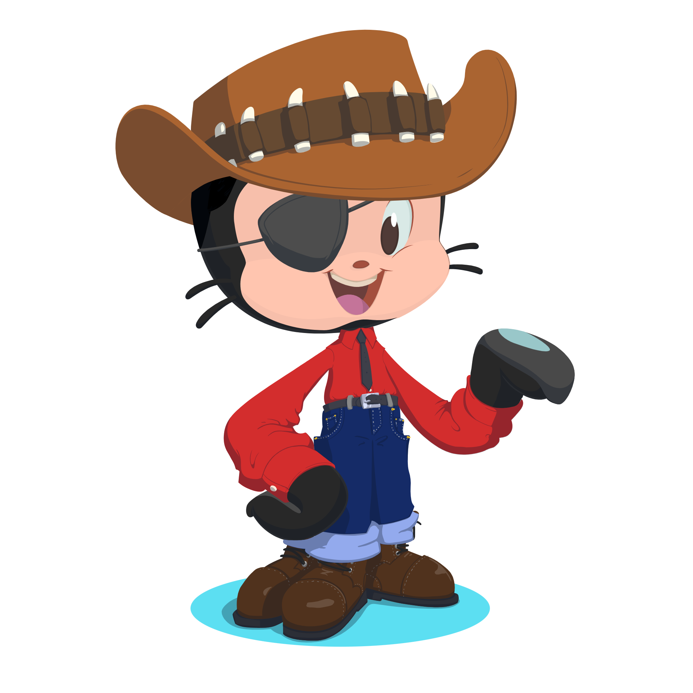

# Programming Fundamentals 2024
## Syed Hur Ali Rizvi
### BSCS-1G

Hi! I am a student of __FAST NUCES__ ~~Lahore~~ *Karachi* campus.\
I am currently a student of **1<sup>st</sup>** semester studying **Bachelors Of _Computer Science_** (BSCS)<sub>2024</sub> here. \

##### Somenone said truly that:
> Education is the most powerful weapon which you can use to change the world.

##### My Intro in from of code:
```
const info = {
  name: "Syed Hur Ali Rizvi",
  age: 18,
  role: "Frontend developer",
  isCriticalThinker: true,
  isProblemSolver: true,
  status : student
};
```
##### I chose computer science because:
+ I love problem solving and development.
+ Computer science is an emerging field and has a large scope in future as well.
+ This allows me to apply skills in other fields like education, finance and healthcare.

##### My Educational Background:

1. Primary education:
  - Class 1-5 - Allied School (TownShip Campus)
2. Secondary education:
  + Class 6 - Allied School (Punjab campus)
  + Class 7-9 - Allied School (Al-Moiz campus)
3. Higher Education (Matric):
  * Class 9-10 - Allied School (Al-Moiz campus)
4. Higher Secondary :
  - ICS (Intermediate of Computer Science) - Punjab College Campus 11(a) Lahore
    + Then shifted to Karachi from Lahore
5. Bachelors:
  - BCS (Bachelors of Commputer Science) - FAST NUCES KARACHI
    * [X] 1<sup>st</sup> Semester 
    - [ ] 2<sup>nd</sup> Semester
    - [ ] 3<sup>rd</sup> Semester 
    - [ ] 4<sup>th</sup> Semester :tada:
   
##### My Profile Image:


